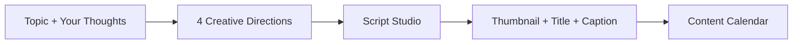

# Z Studio

A single creator desk that turns a topic and your own thoughts into a researched, scripted, packaged, and scheduled piece of content.

## Problem

Creators lose hours switching between tools: a notes app for ideas, a doc for scripts, a design tool for thumbnails, a spreadsheet for the calendar, and separate tabs for research. The work fragments before the video ever gets made. Z Studio keeps the entire pre-production workflow in one place so creators can move from spark to schedule without context switching.

## Solution

Z Studio follows one linear workflow:

The product is built around the creator’s intent. You start with a topic and your own notes, the AI expands them into four distinct creative directions, you pick one, develop a script, generate titles/captions/hashtags, design a thumbnail, and schedule the result to a personal content calendar.

## Core Features

| Feature                              | What it does                                                                                                                                       |
| ------------------------------------ | -------------------------------------------------------------------------------------------------------------------------------------------------- |
| Creator onboarding                   | Collects platform, niche, audience, content format, goal, and posting frequency so every later suggestion stays on-brand.                          |
| Idea Forge                           | Takes a topic plus the creator’s own thoughts and returns 4 distinct directions (story, contrarian, tutorial, experiment, etc.).                   |
| Creator thoughts input               | A large free-form “Your Thoughts” field is treated as the primary creative source, so ideas feel like _yours_ expanded, not invented from scratch. |
| Script Studio                        | Turns a selected idea into a structured script with Hook, Introduction, Main Points, Example, and CTA sections.                                    |
| Thumbnail Studio                     | Builds a branded thumbnail directly in the browser with a headline, kicker, color theme, and layout. Supports PNG export for the selected ratio.   |
| Title & caption generation           | Generates 3 title options, a caption, a description, and platform-appropriate hashtags.                                                            |
| Content Calendar / Planner / Board   | Tracks ideas through Idea → Draft → Ready → Published, with a calendar and board view.                                                             |
| Content Library                      | Stores all created ideas, scripts, packs, and thumbnails in one persistent list.                                                                   |
| Public research (Firecrawl)          | Searches and scrapes public web sources to ground ideas in real trends and data.                                                                   |
| Social profile syncing (SocialFetch) | Imports YouTube, Instagram, and TikTok profile metrics and top posts so recommendations can reflect actual content history.                        |

## How It Works

1. **Sign up or sign in** — Z Studio uses Supabase Auth for accounts.
2. **Set up your profile** — Choose one platform to start (YouTube Videos, YouTube Shorts, Instagram, or TikTok), enter your username, and answer a few questions about your niche, audience, format, and posting frequency.
3. **Open the Idea Forge** — Enter a topic and any rough notes or opinions in “Your Thoughts.” The app reads your saved profile context automatically, so you only type the new idea.
4. **Pick a direction** — The AI returns 4 distinct creative angles. Choose the one that fits your voice.
5. **Write the script** — In Script Studio, the idea is expanded into labeled sections. You can edit, regenerate, shorten, or rewrite any section.
6. **Package it** — One click generates titles, caption, description, and hashtags, then sends the result to Thumbnail Studio.
7. **Design the thumbnail** — Edit text, colors, and layout, then export the cover as a PNG.
8. **Schedule it** — Add the finished item to the Planner, assign a date, and track it through the Kanban-style board or calendar.
9. **Review in Library** — Every saved item lives in the Content Library for later reuse or updates.

Optional intelligence steps:

- **Research** — Search the public web with Firecrawl to generate grounded ideas from recent sources.
- **Intel** — Connect your YouTube, Instagram, or TikTok profile via SocialFetch so Z Studio can compare your real content history with web research and surface opportunities.

## AI & Integrations

- **DeepSeek** — Powers all creative generation: idea expansion, script writing, section revision, titles, captions, and AI insight synthesis. DeepSeek is called from server functions only; the API key never reaches the browser.
- **SocialFetch** — Fetches public profile metadata and top posts for YouTube, Instagram, and TikTok. Stored in the `social_accounts` and `social_posts` tables for analysis.
- **Firecrawl** — Searches the public web and scrapes specific pages for recent research. Used in the Research page and the Intel opportunity analysis.
- **Supabase** — Handles authentication, the PostgreSQL database, and row-level security for user data.

If a key is missing, Z Studio falls back to deterministic local templates so the UI remains testable and demo-ready.

## Tech Stack

- **Framework:** TanStack Start (React 19 + file-based routing + server functions)
- **Styling:** Tailwind CSS v4 with custom Neo-Brutalist design tokens
- **UI primitives:** shadcn/ui + Radix UI components
- **Database & Auth:** Supabase (PostgreSQL + Auth)
- **AI:** DeepSeek API
- **Research:** Firecrawl via Lovable AI Gateway
- **Social data:** SocialFetch API
- **Build tool:** Vite 8

## Security

All API keys are read inside server functions from environment variables and are never exposed to the client. Supabase Auth guards protected operations, and the publishable Supabase key is the only credential shipped to the browser.

environment variables used:

- `VITE_SUPABASE_URL`
- `VITE_SUPABASE_PUBLISHABLE_KEY`
- `SUPABASE_URL`
- `SUPABASE_PUBLISHABLE_KEY`
- `Deepseek_API_Key`
- `LOVABLE_API_KEY`
- `FIRECRAWL_API_KEY`
- `SocialFetch_API_KEY`

## Competition Context

Z Studio was built as an MVP for the HORIZON Creator Tools challenge within a 48-hour window. The goal is to demonstrate that a single, opinionated workflow can remove the friction between “I have an idea” and “my content is scheduled.” The product is intentionally focused on the pre-production phase: ideation, scripting, packaging, and planning.

## Demo

**Live demo:** _https://zstudioashar.lovable.app/auth_
